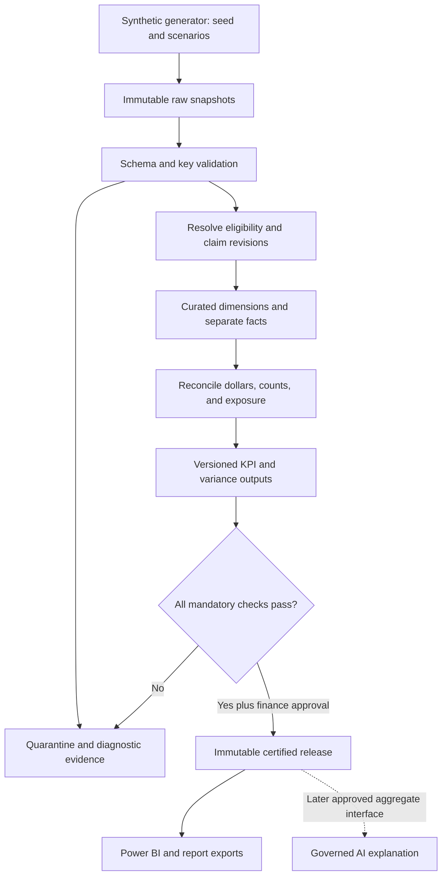

# Architecture

**Version:** 0.1 · **Status:** proposed design, documentation only

## Design choice

Use a local-first Python and SQL workflow with a dimensional reporting model. Python is proposed for reproducible synthetic inputs and orchestration; a relational SQL engine performs transformations, checks, and aggregations. PostgreSQL is the proposed implementation target for familiar SQL and a future Power BI connection, but no engine or dependency is installed in Phase 1.

A spreadsheet-only approach would be easy to start but harder to audit across revisions and markets. An Azure/Fabric-first approach could support a larger platform but adds infrastructure before definitions are stable. The local-first design preserves clear interfaces for later expansion without implementing cloud services now.

## Planned flow and trust boundaries

All nodes are planned. Raw, curated, and certified layers correspond conceptually to bronze, silver, and gold; no lakehouse technology is required.

## Responsibilities and interfaces

| Boundary | Input → output | Responsibility |
|---|---|---|
| Synthetic generation | Scenario/seed → files plus manifest | Fictional data only; intentional defects tagged in a separate expected-defect manifest, never used to bypass rules |
| Raw ingestion | Files → immutable batch | Validate schemas, capture hashes/counts, prevent accidental duplicate batch loading |
| Transformation | Raw batch → dimensions, exposure, resolved claims, signed ledger, capitation | Enforce grains and cutoff; preserve excluded and superseded records in lineage |
| Validation | Raw/curated facts → rule results and reconciliation bridge | Detect missing feeds, fanout, invalid chronology, lifecycle errors, and monetary differences |
| Analytics | Validated facts → KPI components and arithmetic variance | Implement one definition per KPI; anomaly candidates remain review aids |
| Publication | Passed results plus approval → release manifest and marts | Atomically publish a consistent snapshot; retain prior certified release on failure |
| Consumption | Certified release → Power BI/export | Display scope, quality, cutoff, provisional status, and version visibly |

Folder responsibilities follow these boundaries: `src/data_generation`, `src/validation`, and `src/analytics`; `sql/schema`, `sql/transformations`, `sql/quality`, and `sql/kpis`; `data/raw`, `data/synthetic`, and `data/processed`; `powerbi`, `reports`, and `tests`. `src/ai` is reserved for a later approved phase.

## Model and aggregation safety

Conformed market, plan, member, date, provider, and category dimensions connect to separate facts for member-month exposure, final claim headers, final claim lines, FFS payment events, and capitation events. A dimension is a descriptive lookup; a fact records an event or measurable exposure at an explicit grain.

One-to-many relationships run from dimensions to facts. Do not join claim lines directly to exposure and sum membership. Aggregate each fact to the reporting grain first. Header counts come from distinct claim families, while category dollars come from lines. Provider/category filters cannot silently shrink the population denominator. Plan belongs to a market and must match the fact's market assignment.

Service-month spend and paid-month activity use separate date roles and separate measures. Default Power BI service-month reporting cannot reuse the paid-date relationship implicitly. Managed-care encounter measures and capitation measures stay separate; no “total cost” card adds them.

## Release lifecycle and reconciliation

1. Freeze scenario configuration, expected market-month coverage, input checksums, and cutoff.
2. Validate raw input and resolve claim chains as of the cutoff. Preserve history; never overwrite raw files.
3. Build exposure and facts. Record deduplication, exclusions, reversals, and quarantine explicitly.
4. Reconcile unique signed FFS ledger balances to final FFS claim balances before population exclusions, then bridge exclusions to KPI spend. Separately reconcile final header/line totals, capitation, and member-month counts. Raw claim-version dollar sums are not financial totals.
5. Require zero unresolved blocking rows and cent-level monetary agreement. All selected market-month partitions must pass before a combined release is certified.
6. Calculate KPI components and deterministic variance; mark unsupported comparisons unavailable. Review valid material movements separately from data defects.
7. Finance approver accepts the release and documented warnings. Publish marts and manifest together under an immutable release ID.

Run states: CREATED → VALIDATING → FAILED or READY_FOR_REVIEW → CERTIFIED. Failed runs are retained for diagnostics. Warnings require explicit recorded disposition. A failed refresh does not relabel the previous certified data as current.

Late synthetic claims, corrections, mapping changes, or definition changes produce a new run and release. Preserve prior results, report the delta, and use one release consistently across every visual. Repeated execution with identical inputs, seed, cutoff, and versions must reproduce components and control results; run timestamps may differ. Cutoff policy is a portfolio configuration, not a claim that TAF is available in real time.

## Power BI and reporting contract

Future model uses Import mode against certified SQL views or matching versioned exports. The publication layer exposes numeric numerator/denominator components, not only formatted text. Measures calculate ratios from sums. Hide summable header amounts where line facts could cause double counting. Distinct claim counts under combined category selection must come from final claim detail or a distinct-key bridge, never the sum of category counts.

Required visuals: monthly FFS spend/PMPM/membership; cross-market variance with matching cohorts; category spend contributions; separate encounter utilization and capitation panels; quality and release history. Every page identifies synthetic data, service versus paid time basis, filters, as-of cutoff, definition version, provisional periods, and validation status. An unavailable KPI displays its reason. CSV exports include the same metadata. No PBIX, DAX, scheduled refresh, or report export is built in this phase.

## Later governed AI boundary

The AI layer may eventually explain **only certified KPI outputs and validated arithmetic variance facts**. Its allowlisted input contract contains release ID, KPI ID/version, cohort filters, numerator, denominator, value, comparison basis, variance components, quality status, provisional status, and evidence IDs. It receives no member-level rows, claim text, unrestricted SQL access, or raw files.

Deterministic code computes all financial values before AI receives them. AI can describe an observed membership or category contribution, cite evidence, and suggest an investigation question. It cannot infer clinical causes, declare fraud, fill missing metrics, modify numbers, publish reports autonomously, or treat a statistical flag as a proven explanation. Missing, failed, conflicting, or incomparable evidence requires abstention. Provisional data must be described as provisional.

Future controls include role-based aggregate access, input/output logging, prompt/model versioning, checks that cited values match the release, prompt-injection tests, and human approval before narrative publication. These are design requirements only; no model integration or compliance certification is implied.

## Future verification and learning sequence

Start implementation in a separate task with a small fixture containing a member without claims, partial-month coverage, a two-line claim, a replacement, a void, a denied claim, zero-dollar encounter, capitation correction, duplicate input, and missing market feed. Verify the [KPI examples](kpi_dictionary.md), key constraints, financial bridges, and blocked publication before larger synthetic volumes.

Business learning proceeds with each artifact: membership versus exposure; FFS versus capitation; fact and dimension grains; PMPM and ratio aggregation; variance decomposition; then quality and audit trails. Only after validated SQL outputs should Power BI, anomaly routines, automation, and finally AI be separately scoped. No later-stage code or services are part of this delivery.
